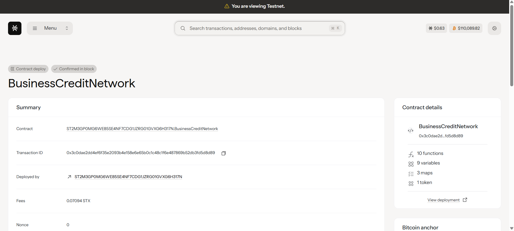

# BusinessCredit Network

## Project Description

BusinessCredit Network is a revolutionary B2B credit scoring and lending platform built on the Stacks blockchain using Clarity smart contracts. The platform enables businesses to establish creditworthiness based on their transaction history and business relationships within the network. By leveraging blockchain technology, we create a transparent, decentralized credit system that allows businesses to access credit based on their proven track record of successful transactions and partnerships.

The system automatically calculates and updates credit scores based on transaction volume, frequency, and relationship strength between businesses. This creates a dynamic, real-time credit assessment that reflects actual business performance rather than traditional static credit metrics.

## Project Vision

Our vision is to democratize B2B lending by creating a decentralized credit network where businesses can:

- **Build Credit Through Performance**: Establish creditworthiness through actual business transactions and relationships rather than relying solely on traditional credit bureaus
- **Access Instant Credit**: Receive immediate access to credit tokens based on real-time credit scores and business relationships
- **Transparent Scoring**: Benefit from a transparent, blockchain-based credit scoring system that eliminates opacity in credit decisions
- **Network Effects**: Leverage the strength of business relationships and network effects to improve credit access and terms
- **Global Accessibility**: Enable businesses worldwide to participate in a unified credit network regardless of their geographic location or traditional banking relationships

We envision a future where small and medium businesses can access credit based on their proven business performance, creating a more inclusive and efficient B2B financial ecosystem.

## Future Scope

### Phase 2 Enhancements
- **Multi-tier Credit Products**: Implement different types of credit products (short-term, long-term, revolving credit)
- **Interest Rate Mechanisms**: Dynamic interest rates based on credit scores and market conditions
- **Collateral Management**: Smart contract-based collateral systems for secured lending
- **Credit Insurance**: Decentralized insurance pools to protect lenders

### Phase 3 Advanced Features
- **AI-Powered Risk Assessment**: Integration with off-chain AI models for advanced credit risk analysis
- **Cross-Chain Compatibility**: Expand to other blockchains for broader business network coverage
- **Governance Token**: Implement DAO governance for platform parameters and upgrades
- **Credit Derivatives**: Create tradeable credit derivatives and secondary markets

### Phase 4 Enterprise Integration
- **ERP Integration**: Direct integration with popular enterprise resource planning systems
- **Supply Chain Finance**: Specialized products for supply chain financing and trade credit
- **Regulatory Compliance**: Enhanced compliance features for different jurisdictions
- **Banking Partnerships**: Integration with traditional banking systems for hybrid solutions

### Technical Roadmap
- **Oracle Integration**: Real-world data feeds for enhanced credit assessment
- **Layer 2 Solutions**: Implementation of layer 2 scaling solutions for high-frequency transactions
- **Mobile Application**: Dedicated mobile app for business credit management
- **Analytics Dashboard**: Advanced analytics and reporting tools for businesses and lenders
- **API Ecosystem**: Comprehensive APIs for third-party integrations and ecosystem development

## Contract Address Details
Contract ID: ST2M3GP0MG6WE85SE4NF7CDG1JZRG01GVXG6H317N.BusinessCreditNetwork

### Mainnet Deployment
- **Contract Address**: `[To be added after mainnet deployment]`
- **Network**: Stacks Mainnet
- **Deployment Date**: `[To be added]`
- **Deployer Address**: `[To be added]`

### Testnet Deployment
- **Contract Address**: `[To be added after testnet deployment]`
- **Network**: Stacks Testnet
- **Deployment Date**: `[To be added]`
- **Deployer Address**: `[To be added]`

### Contract Verification
- **Source Code**: Verified and available on [Stacks Explorer]
- **Contract Version**: v1.0.0
- **Clarity Version**: Clarity 2.0

---

## Technical Overview

### Core Functions

1. **register-business**: Allows businesses to register on the network and receive initial credit scoring
2. **execute-b2b-transaction**: Enables businesses to conduct transactions that update credit scores and relationship metrics

### Key Features

- **Dynamic Credit Scoring**: Real-time credit score updates based on transaction performance
- **Relationship Mapping**: Track and score business-to-business relationships
- **Credit Token System**: Fungible tokens representing credit capacity
- **Transparent Operations**: All transactions and score updates recorded on blockchain
- **Automated Compliance**: Smart contract-enforced business rules and validation

### Getting Started

1. Deploy the contract to Stacks blockchain
2. Register your business using `register-business` function
3. Begin transacting with other registered businesses
4. Watch your credit score improve with successful transactions
5. Access increased credit limits as your network relationships strengthen

---
